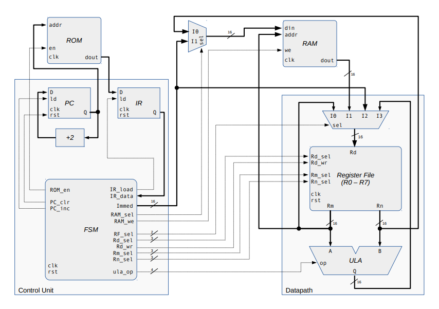

# cpu_16bits

16 bits cpu using the vhdl, a hardware language description

### Table of contents

**[Resources](##Resources)**  
**[Instructions](#instructions)**  
**[FSM](#fsm)**  
**[Observations](#observations)**  
**[Tests](#tests)**  

## Resources

This cpu contain:

* Memory access 
* Aritmetich operations
* 16 bits instruction (like MIPS)

## Instructions

* This processor has load, store and mov operations with immediate values and ram values
* Also has 6 basic operations with ALU

## FSM

 FSM transitions

 
Values of each fsm state

* This FSM represent each state of cpu instructions

* NOP state represent an state with make nothing
* HALT state represent an state with cpu "die"

## Observations

* The ROM of this repository contain some sequence of instructions pre defined
* For testing your program, is recommended modify the values for varied sequence of instructions
* This processor is testing by the following sequence of instructions 
    * MOV R0, 0x02  
    * LDR R1, [R0]
    * MOV R0, 0x04
    * LDR R2, [R0]  
    * ADD R1, R1, R2
    * MOV R0, 0X06  
    * STR [R0], R1 
    *  HALT
        
## Tests
* All components were tested individually with their respective testbenches and their integrations were tested on the CPU testbench

* Below, some more relevant tests are exemplified

CPU:
 
FSM:

ALU:

